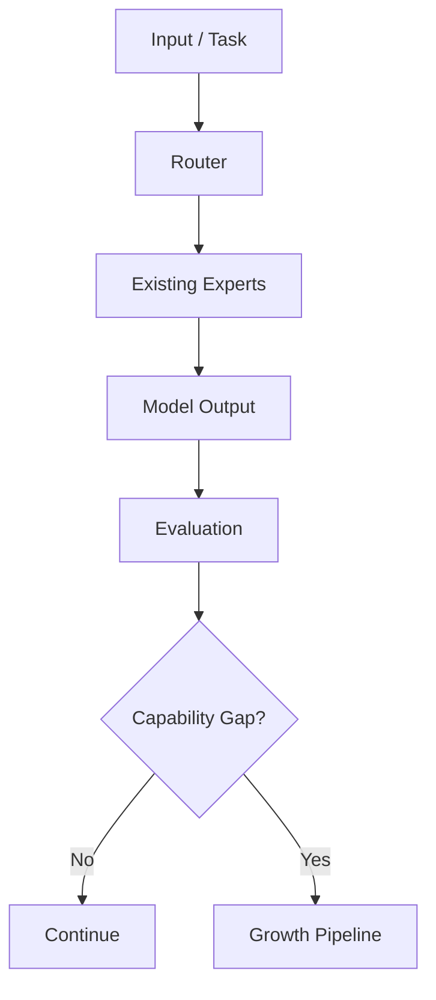
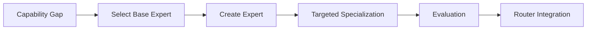
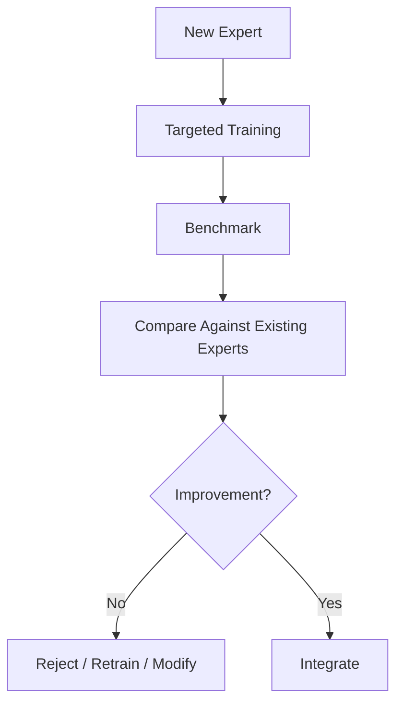
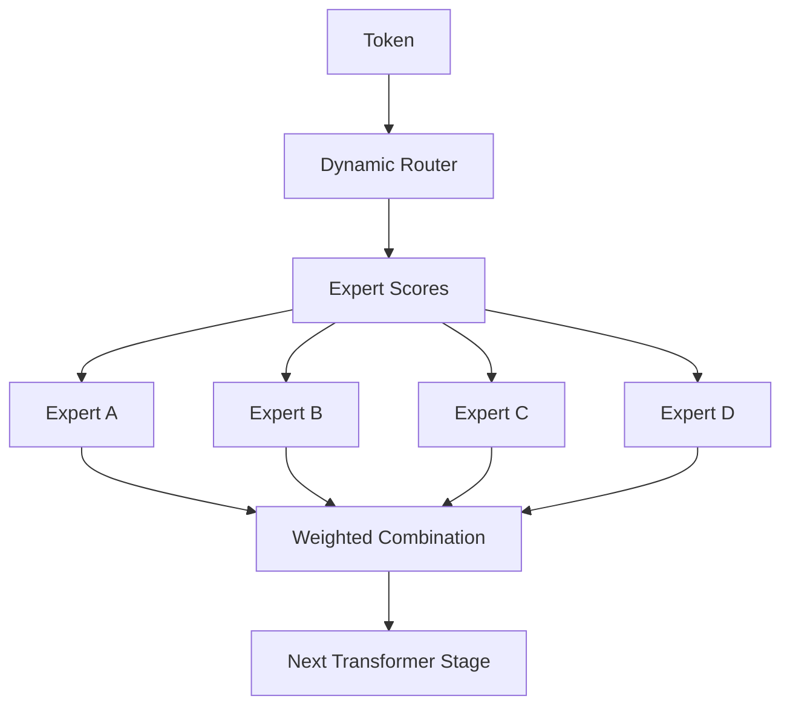
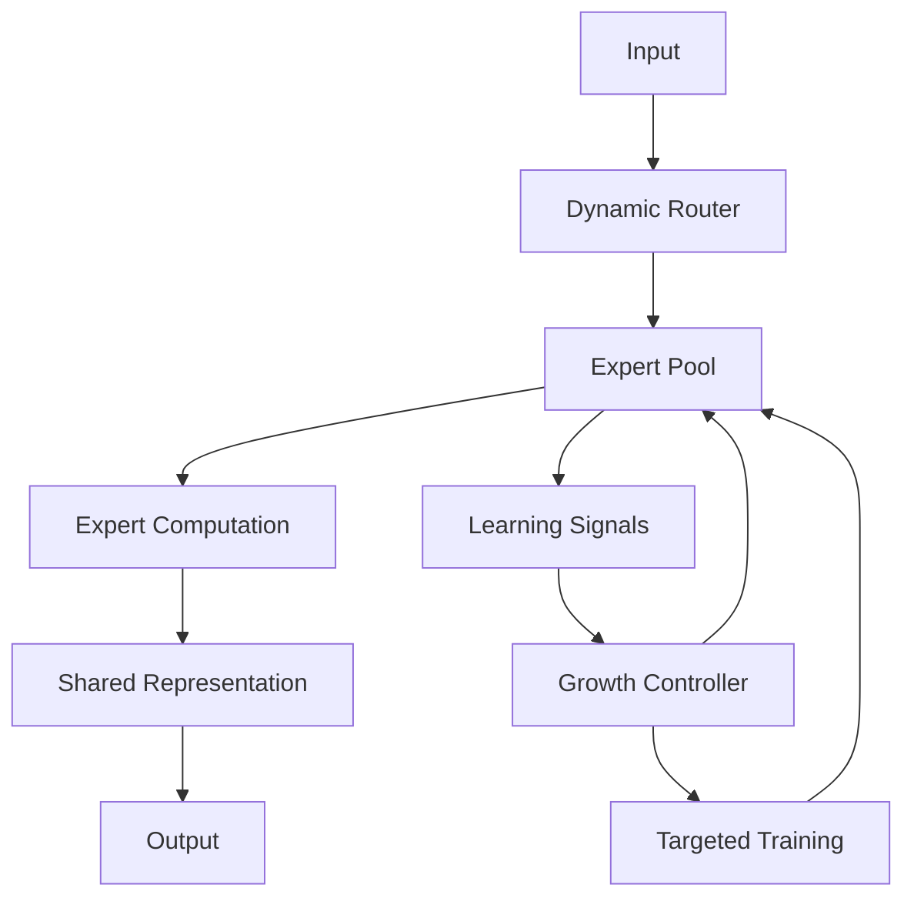
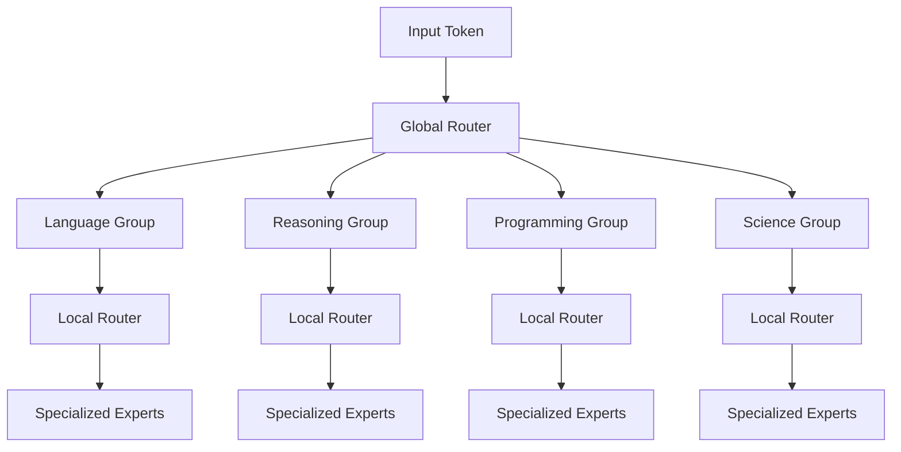
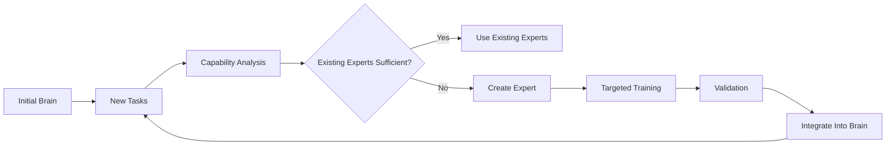
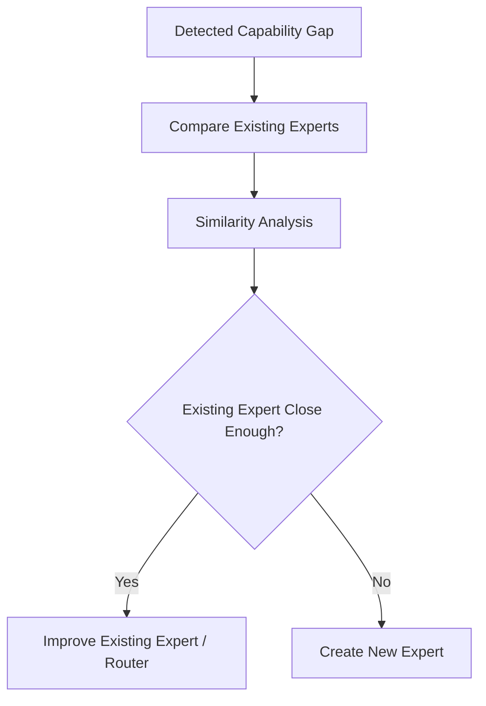
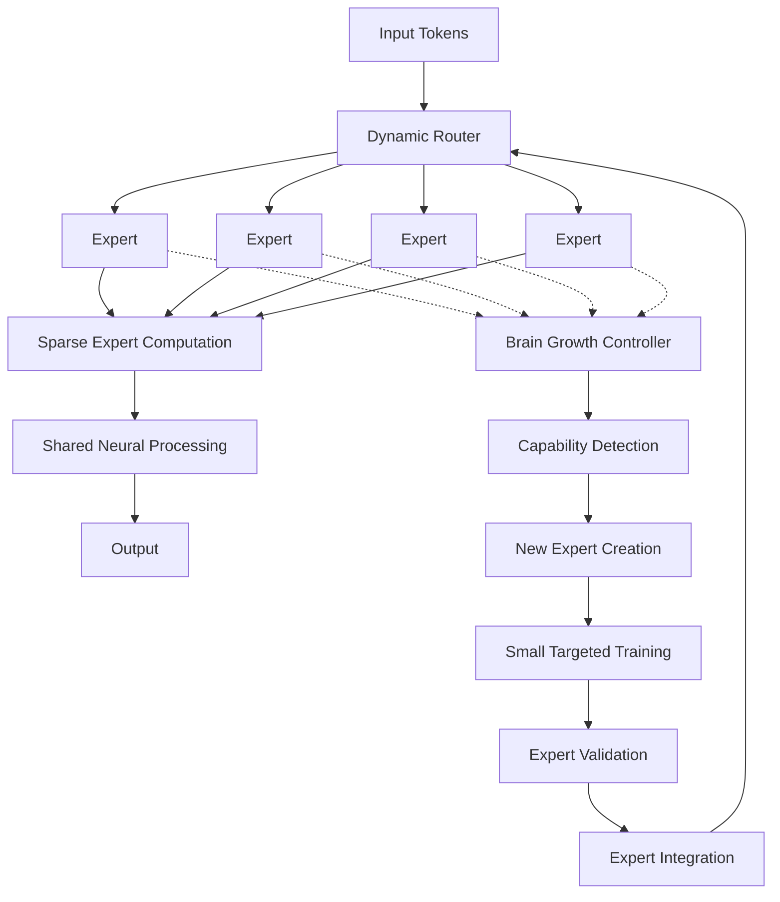

# Titan Brain

**Experimental Self-Growing Mixture-of-Experts LLM Architecture**

> **Repository Notice:** This repository contains architectural and research documentation only. Titan Brain is an experimental architecture concept and not a released production model.

## Overview

Titan Brain is a research-oriented LLM architecture exploring a **self-growing Mixture-of-Experts system**.

The central idea is to build an LLM whose capabilities can expand over time by **creating and training new specialized experts**, rather than repeatedly retraining the entire model.

Titan Brain combines:

- Mixture-of-Experts (MoE)
- Dynamic sparse routing
- Expert specialization
- Incremental expert creation
- Small targeted expert training
- Internal persistent knowledge
- Continual learning
- Load balancing
- Hierarchical specialization

A key constraint is that **only a very small number of experts are activated for each token**.

The target routing design is:

> **Maximum 3–4 experts active per token, regardless of the total number of experts in the brain.**

This allows the total model capacity to grow while attempting to keep inference computationally manageable.

## Objectives

- Investigate whether model capability can grow by adding small specialized experts instead of full retraining.
- Keep token-level inference sparse, with at most 3–4 active experts.
- Let specialization emerge from training and routing rather than hard-coded categories.
- Validate each new expert before it joins the active brain.
- Keep the brain itself — experts, router, shared layers, and growth mechanisms — as one internal neural architecture.

## Core Concept

A conventional dense model can be represented as:

```text
Input
  ↓
Entire Neural Network
  ↓
Output
```

A conventional MoE model instead activates a subset of a fixed collection of experts:

```text
Input Token
     ↓
   Router
     ↓
 Selected Experts
     ↓
Combination
     ↓
Output
```

Titan Brain extends this concept:

```text
                  ┌─────────────────────┐
                  │     Titan Brain     │
                  │                     │
Input Token ────► │  Internal Router    │
                  │         ↓           │
                  │  3–4 Active Experts │
                  │         ↓           │
                  │   Shared Processing │
                  │         ↓           │
                  │ Internal Knowledge  │
                  └─────────────────────┘
                           ↓
                         Output
```

The important difference is that the **brain itself grows**.

When the existing experts cannot efficiently handle a new recurring capability, Titan Brain can potentially create a new expert and give that expert targeted training.

## Self-Growing Expert Architecture

The defining concept of Titan Brain is an **Expert Growth Loop**.

Instead of requiring a complete retraining cycle:

```text
New capability
      ↓
Retrain entire model
      ↓
New model
```

Titan Brain explores:

```text
New capability
      ↓
Detect capability gap
      ↓
Create new expert
      ↓
Collect targeted training data
      ↓
Small expert-training phase
      ↓
Evaluate expert
      ↓
Integrate expert into router
      ↓
Brain gains new capability
```

This means the total number of experts can potentially increase over time. For example:

```text
Initial Brain               New recurring capability detected
                                      ↓
Expert 1                            Create Expert 7
Expert 2                                  ↓
Expert 3                           Targeted training
Expert 4                                  ↓
Expert 5                            Expert 7 joins
Expert 6                                  ↓
                                       Expanded Brain
                                       Expert 1
                                       Expert 2
                                       Expert 3
                                       Expert 4
                                       Expert 5
                                       Expert 6
                                       Expert 7
```

The important distinction is that **Expert 7 does not need to participate in every inference operation**. The router only activates the experts relevant to each token.

## Expert Growth Mechanism

### 1. Capability Detection

The system monitors model behavior and identifies situations where existing experts consistently perform poorly.

Potential signals include:

- repeated failure patterns
- high uncertainty
- poor validation performance
- repeated routing conflicts
- excessive reliance on the same experts
- recurring task categories
- newly emerging knowledge domains

Conceptually:



The important point is that a capability gap does **not automatically mean a new expert should be created**. The system should first determine whether the problem can be solved through existing experts or routing improvements.

### 2. Expert Creation

When a persistent capability gap is identified, Titan Brain can create a new expert initialized from an existing model component or a suitable base representation.

Conceptually:



The new expert is initially similar to an existing expert. It then undergoes **small-scale targeted training**. The goal is specialization rather than learning the entire world from scratch.

### 3. Targeted Expert Training

This is one of the most important aspects of the architecture.

The new expert does not necessarily require a complete LLM training process. Instead:

```text
General Model Knowledge
        +
Targeted Dataset
        ↓
Specialized Expert
```

For example, suppose the system repeatedly encounters difficult mathematical reasoning tasks. The growth system could create:

```text
Expert 27
Specialization:
Mathematical Reasoning
```

and train it using a targeted dataset containing:

- mathematical problems
- derivations
- proofs
- symbolic reasoning
- numerical reasoning
- difficult reasoning examples

The training process could therefore be significantly smaller than training the entire model.

### 4. Expert Validation

A newly trained expert should **not immediately become part of the active brain**. It first enters an evaluation stage:



Evaluation could measure:

- specialization performance
- generalization
- interference with existing capabilities
- routing quality
- inference cost
- expert load
- catastrophic forgetting
- performance on unrelated tasks

Only sufficiently useful experts should become active members of the brain.

## The Brain Grows, But Compute Does Not Grow Proportionally

This is a central design principle.

Imagine Titan Brain eventually contains 1,000 experts. A naive system might require hundreds of experts to participate in every token. Titan Brain instead attempts:

```text
1,000 total experts
        ↓
      Router
        ↓
Maximum 3–4 experts
        ↓
Token computation
```

Therefore:

> **Total model capacity can grow independently from the number of experts activated per token.**

The architecture is therefore based on **large potential capacity with highly sparse computation**.

## Sparse Token Routing

Every token is evaluated by the routing system. Conceptually:



The router may score many candidate experts, but only the highest-ranked **3–4 experts** are activated. For example:

```text
Token:
"Calculate the derivative of..."

Router scores:

Mathematics Expert       0.47
Reasoning Expert         0.28
Programming Expert       0.09
Language Expert          0.07
General Expert           0.04
History Expert           0.01
...

Selected:

Mathematics   ✓
Reasoning     ✓
Language      ✓

Others        ✗
```

The exact routing mechanism remains an experimental research question.

## The Brain Is Internal

A critical architectural distinction is that the **Brain is not an external memory component**. Titan Brain refers to the complete adaptive neural architecture itself.

```text
┌─────────────────────────────────────────────┐
│                 TITAN BRAIN                 │
│                                             │
│  ┌──────────────┐                           │
│  │    Router    │                           │
│  └──────┬───────┘                           │
│         │                                   │
│    ┌────┴───────────────┐                   │
│    ↓        ↓       ↓    ↓                  │
│ Expert   Expert  Expert Expert              │
│   1        8      27     41                 │
│    │        │       │      │                │
│    └────────┴───────┴──────┘                │
│              │                              │
│       Internal Knowledge                    │
│       & Learned Parameters                  │
│              │                              │
│       Shared Model Layers                   │
│              │                              │
│        Output Representation                │
│                                             │
│      Expert Growth Mechanism                │
│              │                              │
│       New Expert Creation                   │
│              ↓                              │
│       Targeted Training                     │
│              ↓                              │
│       Router Integration                    │
└─────────────────────────────────────────────┘
```

There can still be persistent storage for datasets, checkpoints, training states, or auxiliary information, but **the conceptual brain itself is the neural architecture**, not an external database.

## Internal Knowledge Architecture

Titan Brain can be viewed as having several interconnected components:



The expert pool therefore acts as part of the model's internal computational capacity.

## Expert Lifecycle

Every expert can conceptually move through several states:

```text
                     ┌───────────────┐
                     │    Created    │
                     └───────┬───────┘
                             ↓
                     ┌───────────────┐
                     │    Training   │
                     └───────┬───────┘
                             ↓
                     ┌───────────────┐
                     │   Evaluation  │
                     └───────┬───────┘
                             ↓
                       ┌─────┴─────┐
                       │           │
                     Failed      Passed
                       │           │
                       ↓           ↓
                    Retrain     Integrate
                                   │
                                   ↓
                             Active Expert
                                   │
                                   ↓
                              Monitoring
                                   │
                       ┌───────────┴───────────┐
                       ↓                       ↓
                    Improve                  Retire
```

This creates an **expert lifecycle management system**.

## Expert Specialization

Specialization should ideally emerge from training rather than being completely hard-coded.

Possible expert types could eventually emerge around:

- mathematics
- programming
- natural language
- reasoning
- science
- planning
- code debugging
- structured data
- domain-specific knowledge
- multimodal processing

However, these labels are conceptual. The system should ultimately determine specialization from performance and routing behavior.

## Expert Duplication and Specialization

Another possible growth mechanism is **expert splitting**.

Suppose one expert becomes responsible for several related capabilities:

```text
Expert 12

Programming
├── Python
├── Java
├── C++
├── Debugging
└── Software Architecture
```

If the workload becomes sufficiently diverse, Titan Brain could create specialized descendants:

```text
              Expert 12
                  │
        ┌─────────┴─────────┐
        ↓                   ↓
 Python Expert        Architecture Expert
        │
        ↓
 Debugging Expert
```

This creates the possibility of an evolving **expert hierarchy**.

## Hierarchical Expert Routing

As the number of experts grows, a flat router may eventually become inefficient. Titan Brain therefore explores hierarchical routing:



Even with hierarchical routing, the final computation should respect the core constraint:

> **No more than approximately 3–4 experts should be active for a token.**

## Continuous Brain Growth

The long-term vision is an architecture that can evolve:



Over time:

```text
Version 1        Version 2        Version 3        Version 4        Version N
    ↓                ↓                ↓                ↓                ↓
10 Experts       17 Experts       31 Experts       57 Experts   Potentially very
                                                                large expert pool
```

The number of experts can increase while token-level computation remains sparse.

## Why Small Expert Training Matters

Full-model retraining is expensive. Titan Brain explores a different approach:

```text
Full Model Training

Huge Dataset
     ↓
Entire Model
     ↓
Huge Compute Requirement
```

versus:

```text
Expert Growth

Capability Gap
     ↓
Small Targeted Dataset
     ↓
One New Expert
     ↓
Targeted Training
     ↓
Integration
```

The hypothesis is that **incremental specialization could provide a more scalable path for increasing model capabilities**. This is an architectural research hypothesis, not an established claim.

## Load Balancing

As the brain grows, routing imbalance becomes increasingly important. For example:

```text
Expert 1   ████████████████████
Expert 2   █████████████████
Expert 3   ███
Expert 4   █
Expert 5   █
```

A routing system like this wastes the available expert capacity. Titan Brain therefore needs mechanisms that encourage:

- balanced expert utilization
- meaningful specialization
- avoidance of expert collapse
- routing stability
- computational efficiency

At the same time, perfect balance should not be the objective. A highly specialized expert may naturally receive fewer tokens.

## Preventing Expert Redundancy

Creating experts indefinitely could produce many experts that learn essentially the same thing. Therefore, before creating an expert, the growth system could compare the proposed capability against the existing expert population.

Conceptually:



This prevents uncontrolled expert proliferation.

## Expert Retirement

Growth does not necessarily mean that every expert remains active forever. Experts could eventually become:

```text
Active
   ↓
Low utilization
   ↓
Evaluation
   ↓
Retired / Merged / Re-specialized
```

This creates the possibility of an evolving expert population rather than an endlessly expanding one.

## Core Architecture

The complete conceptual architecture can therefore be represented as:



The two major systems are therefore:

### Inference

```text
Token
 ↓
Router
 ↓
Maximum 3–4 Experts
 ↓
Shared Processing
 ↓
Output
```

### Growth

```text
Capability Gap
 ↓
New Expert
 ↓
Small Targeted Training
 ↓
Validation
 ↓
Integration
 ↓
Larger Brain
```

## Research Questions

| Area | Research Question |
|---|---|
| Expert creation | When should a new expert be created? |
| Expert initialization | How should a new expert be initialized? |
| Training | How small can targeted training be? |
| Specialization | How can useful specialization emerge automatically? |
| Routing | How should the router discover new experts? |
| Sparse computation | Can 3–4 experts/token provide sufficient capacity? |
| Growth | How can the brain grow without becoming inefficient? |
| Redundancy | How can duplicate experts be detected? |
| Expert retirement | When should an expert be removed or merged? |
| Stability | How can new experts avoid destabilizing existing behavior? |
| Continual learning | How can new knowledge be added without catastrophic forgetting? |
| Scaling | How does routing behave with thousands of experts? |

## Design Philosophy

Titan Brain is based on several principles:

### 1. Grow the model instead of constantly retraining everything

```text
New capability
      ↓
New specialized expert
```

### 2. Keep inference sparse

```text
Potentially thousands of experts
            ↓
     Maximum 3–4 active
       per token
```

### 3. Specialization should emerge

Experts should become specialized through training and routing rather than being permanently hard-coded into arbitrary categories.

### 4. New experts should earn their place

A newly created expert should be evaluated before becoming part of the active routing population.

### 5. The brain is the architecture

The experts, routing system, shared neural components, and growth mechanisms collectively constitute **Titan Brain**.

## Key Concepts

- Self-growing architecture
- Mixture-of-Experts
- Sparse activation (3–4 experts per token)
- Dynamic and hierarchical routing
- Expert lifecycle management (create → train → validate → integrate → monitor → retire)
- Expert splitting and redundancy prevention
- Continual learning without full retraining
- Load balancing
- Internal (non-external) knowledge architecture
- Efficient LLM inference

## Research Status

Titan Brain is an **experimental architecture concept** exploring whether an LLM can progressively expand its capabilities through **sparse expert computation and incremental expert creation**.

The central research hypothesis is:

> **A model may be able to increase its total computational capacity over time by adding small, specialized experts while keeping token-level inference limited to approximately 3–4 active experts.**

This is a research direction rather than a claim of a completed or state-of-the-art model. The architecture, training strategy, expert-growth mechanism, and routing algorithms would require substantial experimentation and validation.
